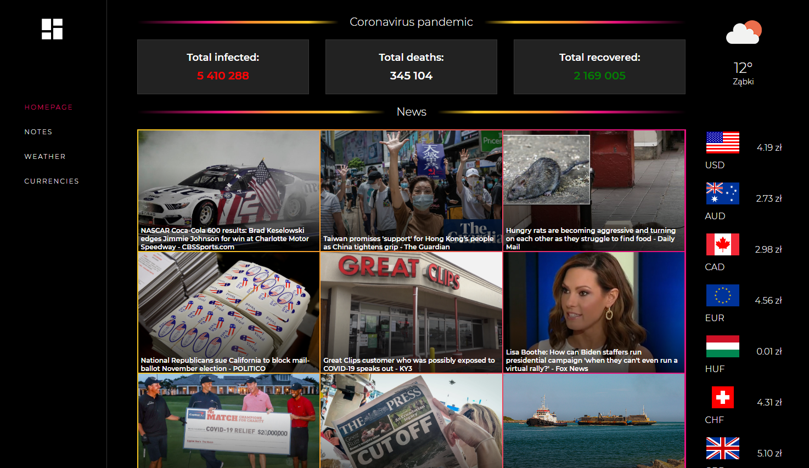
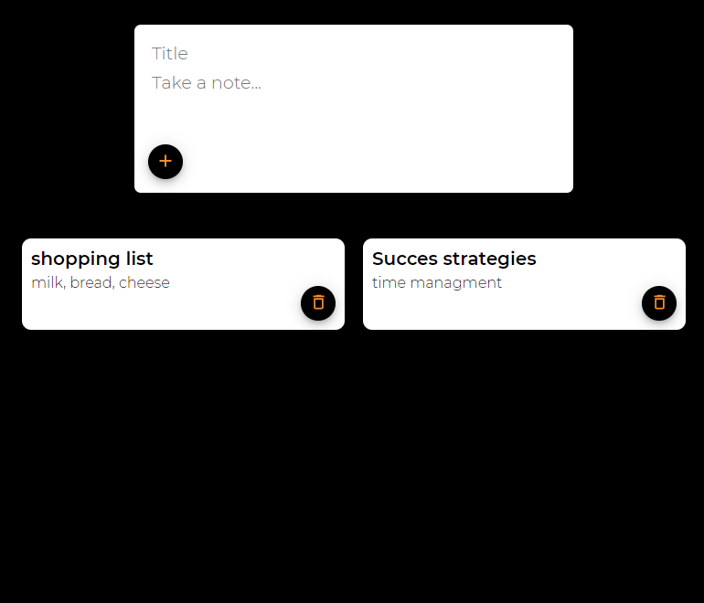
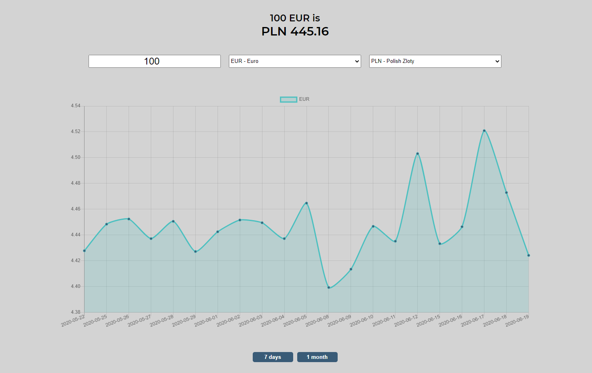

# Dashboard
Now you can check all of the news you need in one place.

You can see: 
* news
* weather
* currencies

* make notes

* convert currencies

## Demo
Click the link - https://waldemarciupa.github.io/dashboard/

## Technologies
Project is created with:
* React
* React Router
* Styled Components
* Chart.js
* local storage

## Used APIs
* https://openweathermap.org/
* https://github.com/najens/weather-icons-react.git
* https://newsapi.org/
* https://gnews.io/
* https://github.com/mathdroid/covid-19-api
* https://https://api.nbp.pl/
* https://api.exchangeratesapi.io